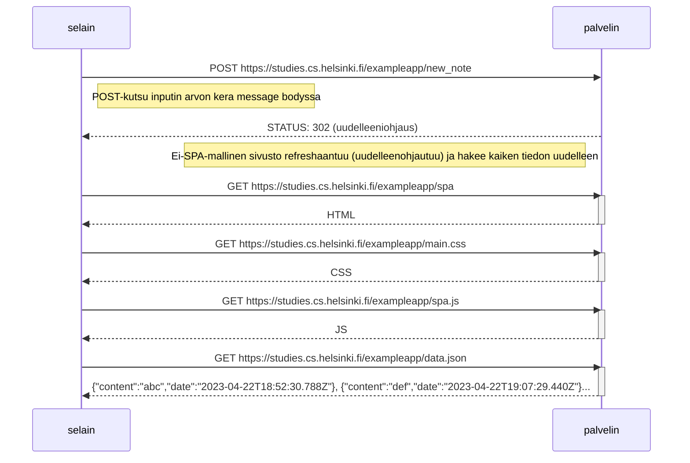

```mermaid
sequenceDiagram
    participant selain
    participant palvelin

    selain->>palvelin: POST https://studies.cs.helsinki.fi/exampleapp/new_note
    Note right of selain: POST-kutsu inputin arvon kera message bodyssa

    palvelin-->>selain: STATUS: 302 (uudelleeniohjaus)
    Note left of palvelin: Ei-SPA-mallinen sivusto refreshaantuu (uudelleenohjautuu) ja hakee kaiken tiedon uudelleen

    selain->>palvelin:GET https://studies.cs.helsinki.fi/exampleapp/spa
    activate palvelin
    palvelin-->>selain:HTML
    deactivate palvelin

    selain->>palvelin:GET https://studies.cs.helsinki.fi/exampleapp/main.css
    activate palvelin
    palvelin-->>selain:CSS
    deactivate palvelin
    
    selain->>palvelin:GET https://studies.cs.helsinki.fi/exampleapp/spa.js
    activate palvelin
    palvelin-->>selain:JS
    deactivate palvelin
    
    selain->>palvelin:GET https://studies.cs.helsinki.fi/exampleapp/data.json
    activate palvelin
    palvelin-->>selain:{"content":"abc","date":"2023-04-22T18:52:30.788Z"}, {"content":"def","date":"2023-04-22T19:07:29.440Z"}...
    deactivate palvelin

```